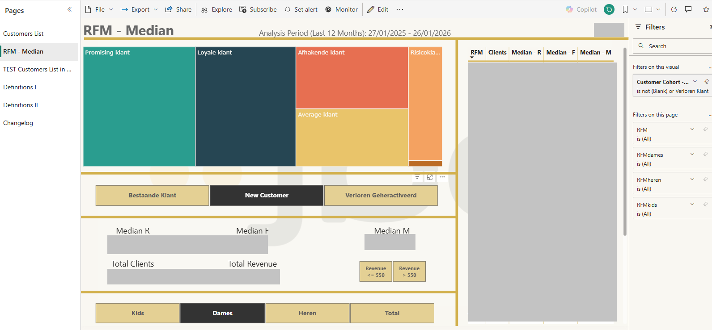
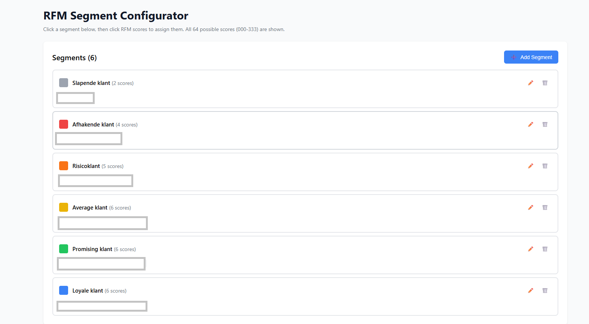
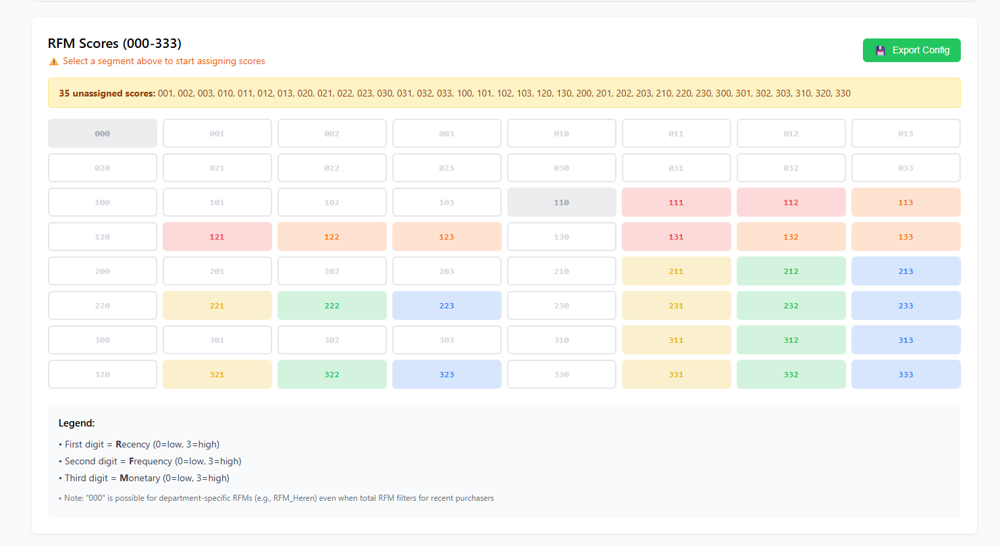
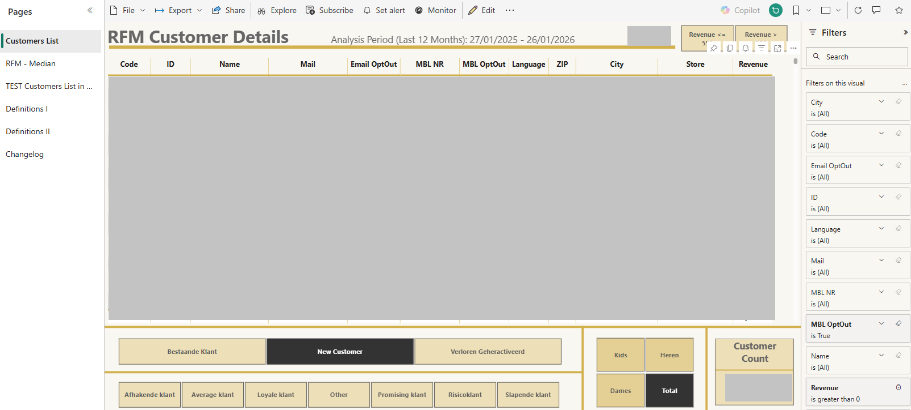
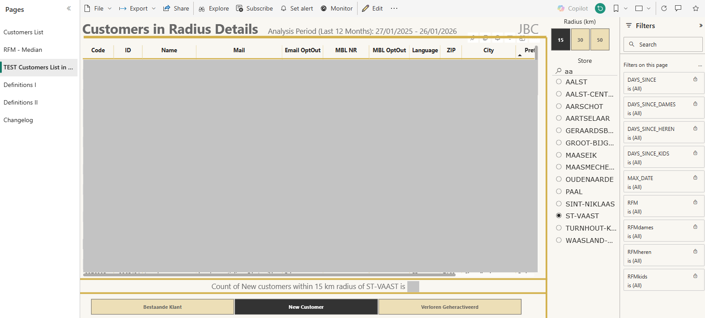
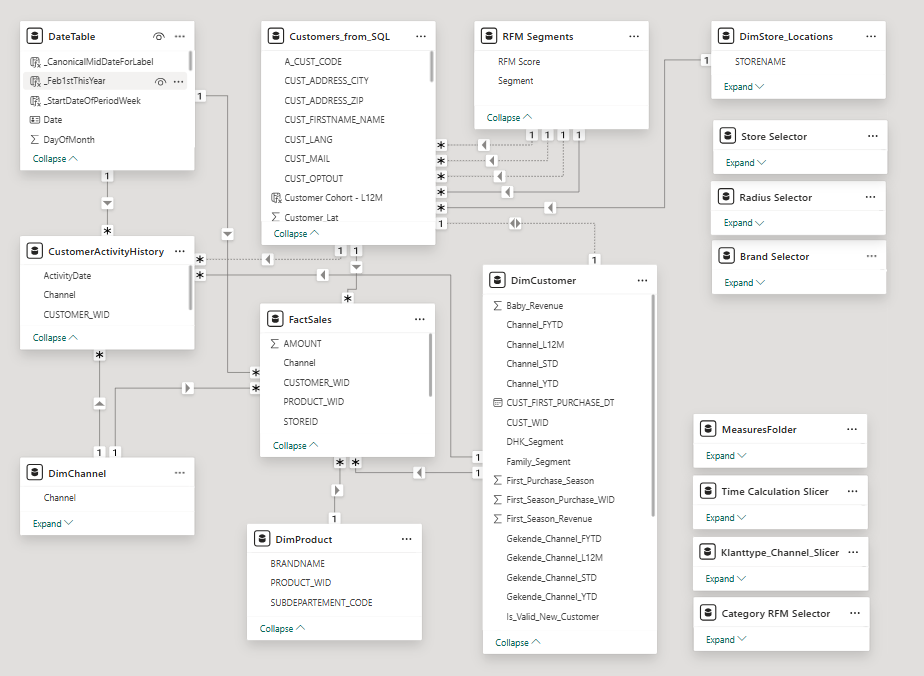
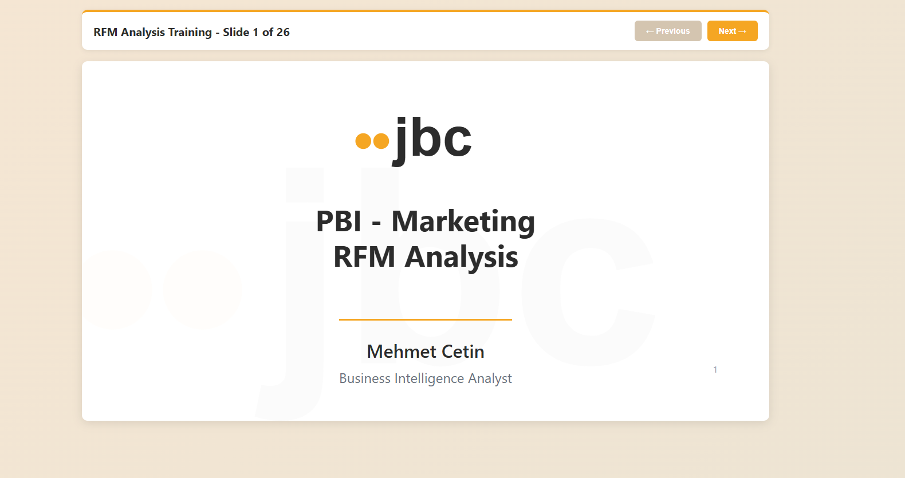

# RFM Customer Segmentation & Analytics Platform

**Transforming marketing operations through intelligent customer segmentation**

## 📊 Business Challenge

The Marketing team needed to segment 800,000+ active customers for targeted campaigns but faced critical operational barriers:

### The Old Process:

* **No self-service capability** - Marketing had to request customer lists from the Data/Analytics team for every campaign
* **Inflexible segmentation** - Could only filter by predefined criteria, couldn't explore customer patterns independently  
* **High dependency** - Each campaign request required analyst time, creating bottlenecks
* **Limited visibility** - No way to understand customer lifecycle stages or value distribution
* **Long turnaround** - 2-3 days between request and receiving customer lists
* **No experimentation** - Couldn't test different segment combinations without multiple back-and-forth requests

### Business Impact:

* Marketing team productivity constrained by analyst availability
* Missed campaign opportunities due to slow turnaround times
* Inability to respond quickly to market opportunities
* Limited data-driven decision making (reliance on gut feel for segments)
* No systematic approach to win-back or retention strategies

## ✨ Solution

Built an end-to-end RFM (Recency, Frequency, Monetary) analytics platform enabling Marketing to independently segment customers, explore behavioral patterns, and generate targeted campaign lists in real-time.

### Core Capabilities:

* **Interactive RFM Segmentation** - 6 configurable customer segments from dormant to champions
* **Custom Segment Builder** - Visual configurator showing all 64 possible RFM score combinations (000-333)
* **Multi-Dimensional Filtering** - Customer cohorts (New/Existing/Reactivated/Lost), product categories, geography
* **Self-Service Exports** - Marketing generates their own filtered customer lists
* **Performance Optimized** - Pre-calculated SQL tables enable sub-3-second dashboard load times despite 800K+ customers
* **Category-Specific Insights** - Track customer behavior by product category for cross-sell opportunities
* **Geographic Analysis** - Experimental radius-based customer targeting using Haversine distance formula

## 📈 Results

| Metric | Before | After | Impact |
|--------|--------|-------|---------|
| **Campaign List Turnaround** | 2-3 days | Real-time | **100% reduction** |
| **Marketing Self-Sufficiency** | 0% (all requests to analysts) | 95% (independent segmentation) | **Eliminated bottleneck** |
| **Segment Flexibility** | Fixed criteria only | 64 RFM combinations + filters | **Infinite combinations** |
| **Dashboard Load Time** | N/A | <3 seconds | **800K+ customers** |
| **Customer Coverage** | Limited visibility | 800K qualified customers analyzed | **Complete view** |
| **Training & Adoption** | N/A | 26-slide training deck created | **Sustainable solution** |
| **Analyst Time Saved** | - | ~10 hours/week | **520 hours annually** |

## 🎯 RFM Segmentation Overview

### What is RFM?

RFM analysis segments customers based on three behavioral dimensions:

* **Recency (R):** How recently did the customer purchase? (Days since last transaction)
* **Frequency (F):** How often do they purchase? (Number of transactions in period)
* **Monetary (M):** How much do they spend? (Total revenue in period)

Each dimension is scored 0-3 (with 3 being best), creating a 3-digit composite score:

* **333** = Champions (recent, frequent, high-value)
* **311** = Loyal Customers (recent, frequent, moderate spend)
* **113** = Big Spenders (recent, infrequent, high-value)
* **111** = At-Risk (dormant, infrequent, low-value)

### Segment Examples:


*Treemap showing distribution of customers across segments - Champions (green), Loyal (blue), At-Risk (red), etc.*

### Custom Segments Configured for Marketing:

* **Champions** - Best customers (high R/F/M)
* **Loyal Customers** - Frequent buyers, may not be highest spenders
* **Promising Customers** - Recent buyers with growth potential
* **At-Risk Customers** - Declining engagement, need retention efforts
* **Dormant Customers** - Haven't purchased recently, win-back candidates
* **Lost Customers** - No activity for extended period, last-chance campaigns

## 🛠️ Interactive Segment Configurator

One of the unique features of this solution is the **RFM Segment Configurator** - a visual tool that allows Marketing to understand and modify segment definitions.

### Configurator Interface:


*Segment list view showing 6 configured segments and number of score combinations assigned to each*


*Grid showing all 64 possible RFM scores (000-333) color-coded by assigned segment*

### How It Works:

1. Each customer gets an RFM score based on percentile thresholds (e.g., "323")
2. Marketing defines which scores belong to which segments
3. The configurator shows all 64 possible combinations in a visual grid
4. Segments are color-coded for easy pattern recognition
5. Changes to segment definitions are immediately reflected in the dashboard

### Why This Matters:

* **Transparency** - Marketing team understands exactly how segments are defined
* **Flexibility** - Can adjust segment boundaries based on campaign needs
* **Education** - Visual tool helps train new team members on RFM methodology
* **Consistency** - Documented segment definitions prevent confusion across campaigns

## 📊 Customer Analytics Dashboard

### Main Features:


*Detailed customer view with multi-dimensional filtering: RFM segments, cohorts, categories, store radius*

**Filtering Capabilities:**
* RFM Segment selection (Champions, Loyal, etc.)
* Customer Cohort (New Customer, Existing, Reactivated, Lost)
* Product Category (Kids, Women's, Men's)
* Geographic radius from selected store
* Revenue thresholds
* Days since last purchase

### Advanced Features:

**Multi-Period Cohort Classification:**
* **New Customers** - First purchase in L12M (validated with €20+ transaction threshold)
* **Existing Customers** - Consistently active, core customer base
* **Reactivated Customers** - Purchased 2-3 years ago, went dormant, came back (win-back success!)
* **Lost Customers** - Active 2-3 years ago, no purchases for 24+ months (last-chance outreach)

**Category-Specific RFM:**
* Track recency/frequency/monetary independently per product category
* Identify cross-sell opportunities (e.g., Kids buyers who never purchased Women's)
* Department-specific reactivation campaigns

**Geographic Targeting (Experimental):**


*Test feature: Find customers within 15/30/50 km radius of selected store using Haversine distance formula*

* Calculates distance between customer's preferred store and target store
* Enables location-based campaigns (e.g., new store openings)
* Uses geographic coordinates and trigonometric calculations

## 🏗️ Technical Architecture

### System Design:

```
Azure SQL Database → Weekly Pre-Calculation → Power BI Service → Marketing Dashboard
        ↓                      ↓                       ↓
   5M+ Transactions    Microsoft Fabric        Sub-3 Second Load
   800K Customers         Notebook               Real-time Filtering
                        Orchestration
```

### Data Model:


*Star schema with pre-calculated customer dimension, sales fact table, and lookup tables*

**Key Tables:**
* **Customers_RFM** - Pre-calculated customer metrics (800K rows, weekly refresh)
* **FactSales** - Transaction-level data (daily refresh for recency)
* **DimProduct** - Product categories and attributes
* **DimStore** - Store locations with geographic coordinates
* **RFM_Segments** - Segment configuration (disconnected table)
* **CustomerActivityHistory** - Historical activity for cohort classification

### Performance Strategy:

**Challenge:** 800K customers × 5M+ transactions = slow dashboards and refresh timeouts

**Solution:** Hybrid architecture with pre-calculated aggregations

1. **Weekly SQL Refresh** - Complex RFM calculations executed in SQL, results stored in `Customers_RFM` table
2. **Daily Incremental Refresh** - Only sales fact table refreshes daily to update recency metrics  
3. **Power BI Calculations** - Simple lookups and filters, no heavy aggregations
4. **Result:** Dashboard loads in <3 seconds despite massive dataset

**Key Optimization:**
```sql
-- Pre-calculate RFM metrics in SQL to avoid runtime aggregation
SELECT 
    CUSTOMER_ID,
    DATEDIFF(DAY, MAX(PURCHASE_DATE), @Today) AS DAYS_SINCE_PURCHASE,
    COUNT(DISTINCT TRANSACTION_ID) AS PURCHASE_FREQUENCY,
    SUM(NET_AMOUNT) AS TOTAL_REVENUE
FROM Sales
WHERE PURCHASE_DATE >= @L12M_Start
GROUP BY CUSTOMER_ID
```

See [technical_approach.md](documentation/technical_approach.md) for detailed architecture decisions.

## 💻 Technical Implementation

### Technologies Used:

* **Azure SQL Database** - Data warehouse and pre-calculation engine
* **Microsoft Fabric Notebooks** - Orchestration and job scheduling  
* **Power BI Service** - Interactive dashboard and data refresh
* **DAX** - Advanced calculations and dynamic segmentation
* **SQL** - Complex aggregations and percentile calculations

### Key Technical Features:

**1. Percentile-Based RFM Scoring**
* Dynamic thresholds using `PERCENTILE.INC()` instead of hard-coded values
* Automatically adapts as customer behavior changes
* Custom distribution: Monetary uses 20/40/40 split (top 20% = high-value customers)

```dax
RFM_Monetary_Score = 
VAR Revenue = Customers_RFM[TOTAL_REVENUE]
VAR Percentile_20 = PERCENTILE.INC(Customers_RFM[TOTAL_REVENUE], 0.20)
VAR Percentile_60 = PERCENTILE.INC(Customers_RFM[TOTAL_REVENUE], 0.60)

RETURN
    SWITCH(TRUE(),
        Revenue >= Percentile_60, 3,  -- Top 40%
        Revenue >= Percentile_20, 2,  -- Middle 40%
        1                             -- Bottom 20%
    )
```

**2. Multi-Period Lifecycle Classification**
* Analyzes customer activity across three 12-month windows
* Detects patterns: New vs Reactivated vs Lost customers
* Enables targeted win-back campaigns

**3. Category-Specific Metrics**
* Separate RFM scores per product category (Kids, Women's, Men's)
* Identifies shopping preferences and cross-sell opportunities
* Powers department-specific marketing strategies

**4. Geographic Distance Calculations**
* Haversine formula for great-circle distance between coordinates
* Accurate distance calculations accounting for Earth's curvature
* Enables radius-based customer targeting

See [sql/rfm_scoring_logic.sql](sql/rfm_scoring_logic.sql) for the weekly refresh query and [dax/key_measures.md](dax/key_measures.md) for core DAX calculations.

## 📚 End-User Training & Documentation

Creating the dashboard was only half the solution - ensuring Marketing could use it effectively was equally critical.

### Training Materials Created:


*26-slide comprehensive training deck covering RFM methodology, dashboard navigation, and best practices*

**Training Content:**
* RFM fundamentals explained for non-technical users
* Step-by-step dashboard navigation guide
* How to interpret segments and scores
* Common campaign use cases with examples
* Tips for effective customer targeting
* Troubleshooting and FAQs

**Adoption Strategy:**
* Live training session with Marketing team
* Hands-on practice with real campaign scenarios
* Follow-up support during first campaigns
* Documentation available as reference guide

### Documentation Artifacts:

1. **User Guide** - Dashboard navigation and feature explanations
2. **RFM Methodology Overview** - Business-friendly explanation of scoring
3. **Segment Definitions** - Clear criteria for each customer segment
4. **Campaign Playbook** - Recommended strategies for each segment type
5. **Technical Documentation** - For BI team maintenance and troubleshooting

**Result:** 95% of Marketing's segmentation needs now handled independently, with only complex ad-hoc requests requiring analyst support.

## 🎓 Skills Demonstrated

This project showcases:

### Business Analysis & Stakeholder Management
* Translated business requirements into technical specifications
* Iterative collaboration with Marketing to refine segment definitions
* Created non-technical training materials for business users
* Balanced flexibility with usability in tool design

### Data Engineering & Architecture
* Designed performant architecture for large-scale customer data
* Implemented hybrid SQL/Power BI solution for optimal performance
* Built reusable, maintainable data pipelines
* Orchestrated multi-step data refresh processes

### Advanced Analytics
* RFM segmentation methodology implementation
* Percentile-based dynamic thresholding
* Multi-period cohort analysis for lifecycle classification
* Geographic distance calculations using trigonometric formulas

### Power BI Development
* Complex DAX calculations with row/filter context manipulation
* Star schema data modeling
* Interactive visualization design
* Performance optimization techniques

### SQL Development
* Window functions and percentile calculations
* CTEs and complex aggregations
* Query optimization for large datasets
* Data quality validation and logging

### Product Thinking
* Self-service tool design (empowering users vs creating dependencies)
* Configuration-driven approach (segment definitions editable by business)
* Iterative development based on user feedback
* Comprehensive training for sustainable adoption

## 📁 Repository Structure

```
rfm-customer-segmentation/
├── README.md                          # This file
├── screenshots/                       # Dashboard and tool screenshots
│   ├── customers_list.png
│   ├── rfm_median.png
│   ├── test_radius.png
│   ├── model_structure.png
│   ├── segment_configurator1.png
│   ├── segment_configurator2.png
│   └── training_material.png
├── sql/
│   └── rfm_scoring_logic.sql         # Weekly refresh query (sanitized)
├── dax/
│   └── key_measures.md               # Core DAX calculations with explanations
├── documentation/
│   └── technical_approach.md         # Detailed architecture decisions
└── LICENSE                           # MIT License
```

## 🔐 Privacy & Data Sanitization

* **Company identifiers** removed (database names, table prefixes anonymized)
* **Segment names** generalized (actual marketing segment names replaced)
* **Business thresholds** not disclosed (percentile approach shown, exact values omitted)
* **Screenshots** anonymized (numbers blurred, sensitive data removed)
* **No production data** included in repository
* **SQL/DAX logic** sanitized but functionally identical to production code

This portfolio demonstrates the methodology and technical approach without exposing proprietary business information.

## 💡 Key Takeaways & Impact

### What Worked Well:

✅ **Pre-calculation strategy** eliminated performance bottlene completely  
✅ **Percentile-based scoring** proved more robust than fixed thresholds  
✅ **Self-service design** dramatically reduced analyst workload  
✅ **Visual configurator** made complex RFM methodology accessible to non-technical users  
✅ **Comprehensive training** ensured sustainable adoption  

### Business Value Delivered:

* **Marketing autonomy** - Team can now execute campaigns independently
* **Faster time-to-market** - Campaign lists generated in minutes vs days
* **Better targeting** - Data-driven segmentation vs gut-feel decisions
* **Analyst time freed** - 520 hours/year reallocated to strategic projects
* **Scalable solution** - Self-service model grows with team needs

### Technical Lessons Learned:

* **Performance optimization** - Sometimes the best solution is pre-calculating at the source
* **User-centric design** - Power users need configuration capabilities, not just predefined reports
* **Documentation matters** - Training and guides are essential for adoption, not optional
* **Iterative development** - Initial MVP → user feedback → refinement led to better product

## 📞 Contact

**Mehmet Cetin**  
Data Analyst | BI Developer  

[](https://www.linkedin.com/in/mehmet-cetin-461674a4/)
[](https://github.com/mcetin-data)

---

*This project demonstrates professional-level BI development, stakeholder collaboration, and end-to-end solution ownership. Available for discussion in technical interviews.*
